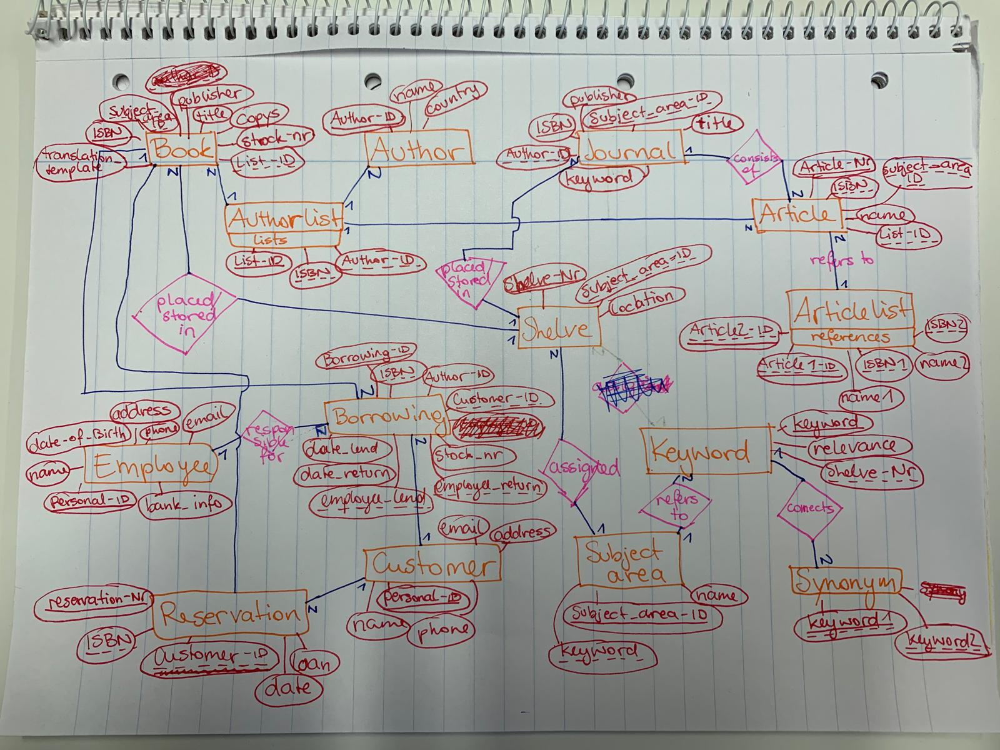
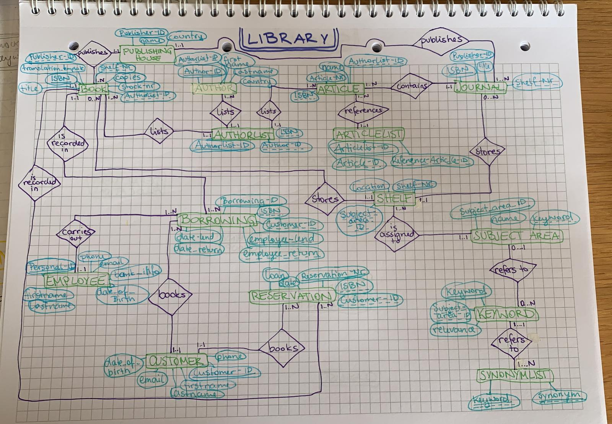

# Library-ERM
A library manages books and journals. Each book is published by a publishing house, there may be several copies of each book, which can also be borrowed by customers. There are published issues of the journals, these are only available once, a loan is not possible.
The articles published in the journals as well as the books should be managed in such a way that comfortable functions for information retrieval are possible: In addition to the assignment of a subject area, there should also be a keyword, whereby the relevance of each assigned keyword is important. Synonymous keywords should be recorded. Articles and books can each have several authors. Certain books can each have one book as a translation template, articles can reference each other:
Each borrowing is handled by one employee, and one employee is also responsible for returning the book copy.
Customers can also reserve books, each reservation usually results in a loan. The books and magazines are stored on shelves. A journal is placed on a shelf, and each shelf is assigned a subject area for te storaghe of the books.

## ER-Model

 
second draft:

## Relational Model (updated to second draft)

* Book (**ISBN:int**, _shelf-Nr:int_, _authorlist-ID:int_, _publisher-ID:int_, title:varchar(32), copies:int, stock_nr:int, translation_template:boolean)
* Publishing House (**publisher-ID:int**, companyName:varchar(32), country:varchar(32))
* Authorlist (**authorist-ID:int**, _ISBN:int_, _author-ID:int_)
* Author (**author-ID:int**, _authorlist-ID:int_, firstname:varchar(32), lastname:varchar(32), country:varchar(32))
* Article (**article-Nr:int**, *ISBN:int*,  _authorlist-ID:int_, *articlelist-ID:int*, articleName:varchar(32))
* Articlelist (**articlelist-ID:int**, _article-ID:int_, _referenced-article-ID:int_)
* Subject Area (**subject-area-ID:int**, _keyword:varchar(32)_ designation:varchar(32))
* Employee (**personal-ID:int**, firstname:varchar(32), lastname:varchar(32), birthday:date, phone:varchar(32), email:varchar(32), bank_information:varchar(32))
* Customer (**customer-ID:int**, firstname:varchar(32), lastname:varchar(32), phone:varchar(32), email:varchar(32), birthday:date)
* Shelf (**shelf-Nr:int**, _subject-area-ID:int_, location:varchar(32))
* Borrowing (**borrowing-Nr:int**, _ISBN:int_, _customer-ID:int_, date_lending:date, date_return:date, _employee-lending:int_, _employee-return:int_)
* Keyword (**keyword:varchar(32)**, _subject-area-ID:int_, relevance:int)
* Synonymlist (**_keyword:varchar(32)_**, **_synonym:varchar(32)_**)
* Reservation (**reserveration-Nr:int**, _customer-ID:int_, _ISBN:int_, loan:double, date:date)
* Journal (**ISBN:int**, *publisher_ID:int*, *shelf-Nr:int*, title:varchar(32), issue:varchar(7))

## Library Schema

